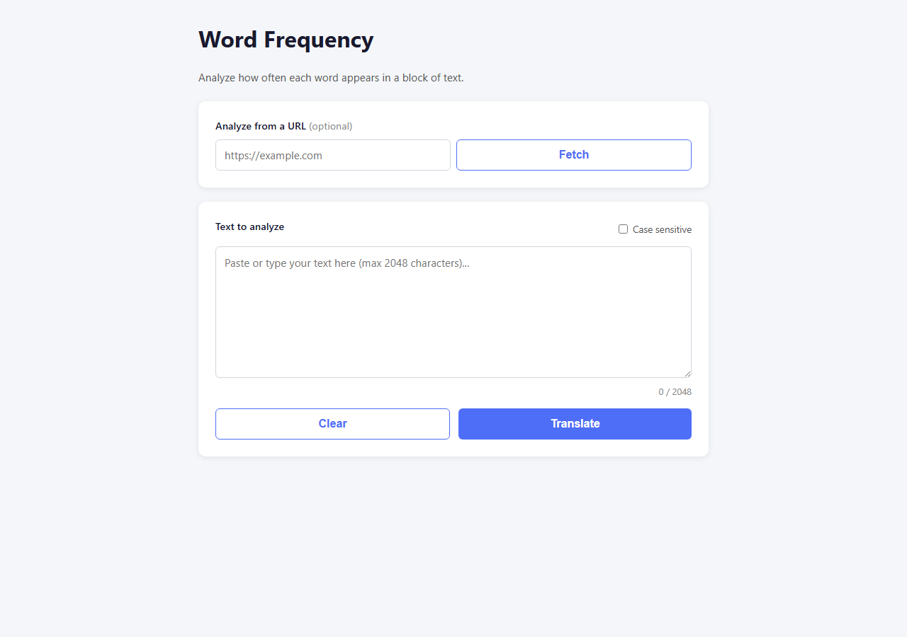
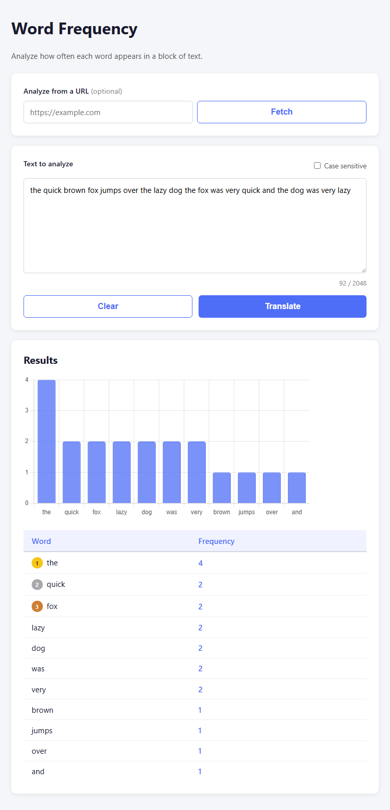
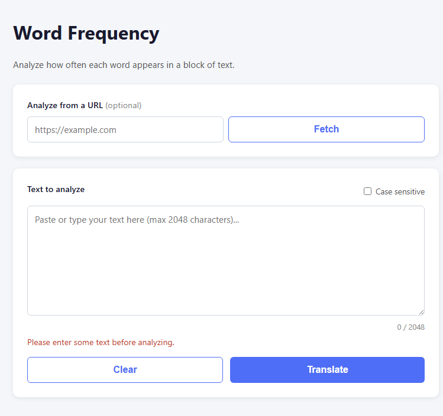
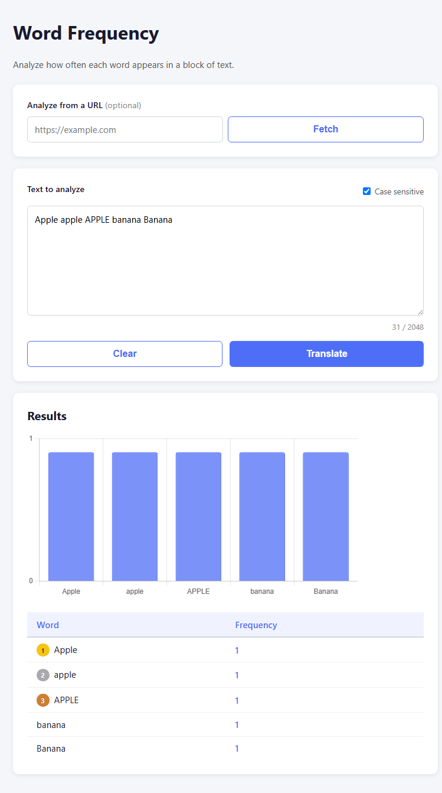

# Word Frequency

A web app that analyzes how often each word appears in a block of text. Paste text or provide a URL, click **Translate**, and get a bar chart and frequency table sorted from most to least common.

**Tier:** 1 — Beginner

---

## Screenshots

| Initial | Results |
|---|---|
|  |  |

| Error message | Case-sensitive mode |
|---|---|
|  |  |

---

## Features

### Core
- Textarea accepting up to 10 000 characters
- **Translate** button triggers word frequency analysis
- Error message when the input is empty
- Frequency table (Word / Count) sorted descending

### Bonus
- Bar chart of the top 15 words via Chart.js
- URL input: fetch and analyze the text content of any public webpage

### Extra
- **Clear** button resets the textarea, chart, and table
- Case-sensitive toggle (default: lowercase)
- Unicode support for accented characters (`é`, `ñ`, `ü`, …)
- Gold / silver / bronze ranking badges for the top 3 words
- Live character counter with visual warning near the limit (at 9 000 chars)
- Friendly notice when the 10 000-character limit is reached (page content was truncated)
- Accessibility: `aria-live` on results, `aria-describedby` on inputs

---

## Stack

| Layer | Technology |
|---|---|
| Language | Vanilla JavaScript |
| Markup | HTML5 |
| Styles | CSS3 (no framework) |
| Chart | Chart.js (CDN) |
| URL fetch | Fetch API + `allorigins.win` CORS proxy |

No build tool, no bundler, no framework.

---

## Running locally

### Option 1 — Open directly in the browser

```bash
# Windows
start index.html

# macOS
open index.html

# Linux
xdg-open index.html
```

> The URL-fetch feature does **not** work when opened via `file://` — the browser treats the origin as `null` and the CORS proxy rejects it. Use Option 2 for that feature.

### Option 2 — Local server (recommended)

```powershell
# PowerShell (no extra dependencies)
powershell -ExecutionPolicy Bypass -File serve.ps1
```

```bash
# Node.js
npx serve .

# Python 3
python -m http.server 8080
```

Then open `http://localhost:8080` in your browser.

---

## Project structure

```
word-frequency/
├── index.html    # Landing page
├── app.html      # Application page
├── style.css     # Styles (dark mode)
├── script.js     # Analysis logic and rendering
├── serve.ps1     # PowerShell dev server
└── App.md        # Original project specification
```

---

## Resources

- [Bag-of-Words Model — Wikipedia](https://en.wikipedia.org/wiki/Bag-of-words_model)
- [Sentiment Analysis — Wikipedia](https://en.wikipedia.org/wiki/Sentiment_analysis)
- [Chart.js documentation](https://www.chartjs.org/docs/)
